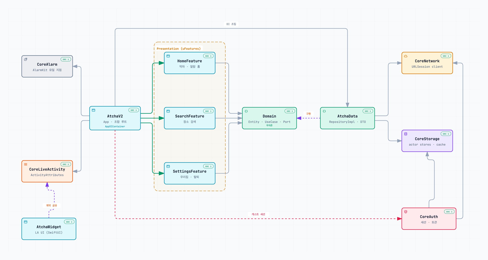

# 🚌 앗차 (Atcha)

> 이제 클릭 한 번으로 막차 확인하고, 택시비를 아끼는 스마트한 대중교통 동반자

<div align="center">


</div>

## 📱 프로젝트 소개

**앗차**는 막차 시간을 놓칠까 걱정하는 모든 이들을 위한 iOS 애플리케이션입니다.  
내 위치를 기반으로 빠르게 막차 정보를 찾고, 출발해야 할 시점에 알림으로 알려줍니다.  
더 이상 막차를 놓치는 일은 없을 거예요!


> 이 레포는 현재 **앗차 2.0(AtchaV2)** 을 Tuist 기반 모듈러 구조로 새로 만드는 중입니다.
> 기존 1.x 앱(레거시)은 스토어 배포를 위해 그대로 함께 유지됩니다 — [레거시 앱](#-레거시-1x-앱) 참고.

## ✨ 주요 기능 (2.0)

### 🚏 막차 확인
- **위치 기반 검색**: 현재 위치에서 우리집까지 버스·지하철 막차 경로를 한 번에
- **출발 기준 정리**: 지금 출발해야 하는 경로와 이미 떠난 막차를 구분해서 표시
- **장소 검색**: 출발지·도착지 검색과 최근 검색 기록

### ⏰ 막차 알람
- **AlarmKit 알람**: 무음 모드에서도 울리는 시스템 알람으로 출발 시점 알림
- **Live Activity**: 잠금화면·다이나믹 아일랜드에서 남은 시간 확인
- **서버 동기화**: 앱 재실행·포그라운드 복귀 시 서버와 알람 상태를 맞춤

### ⚙️ 간편한 시작
- **게스트 계정**: 회원가입 없이 바로 시작 (기기 식별자 기반 인증)
- **우리집 설정**: 서비스 지역 확인 후 집 주소 등록

## 🏗️ 아키텍처

**uFeatures(Tuist 모듈러) + 클린 아키텍처.** 앱 타겟이 조합 루트(Composition Root)가 되어 모든 구체 타입을 조립하고, 각 피처는 Domain 프로토콜만 바라봅니다.

<p align="center">
  <picture>
    <source media="(prefers-color-scheme: dark)" srcset="docs/assets/atcha-v2-architecture-dark.png">
    
  </picture>
</p>

<sub>[Archify](https://github.com/tt-a1i/archify)로 생성했습니다. 노드마다 근거가 된 `Project.swift`가 연결된 인터랙티브 버전: [`docs/architecture/atcha-v2-modules.html`](docs/architecture/atcha-v2-modules.html) (내려받아 브라우저로 열기) · 원본 스펙: [`atcha-v2-modules.architecture.json`](docs/architecture/atcha-v2-modules.architecture.json)</sub>

### 의존 규칙

- **Presentation → Domain ← Data** — Feature 모듈은 `AtchaData`를 절대 import하지 않으며, Domain은 아무것도 의존하지 않습니다.
- **조합 루트는 앱뿐** — 구체 Data/Network 타입을 아는 곳은 `AppDIContainer` 하나입니다. `NetworkClient → RepositoryImpl → UseCase → 피처 DIContainer` 순서로 주입합니다.
- **피처 간 참조는 Interface 타겟으로만** — 예: Home은 `SearchFeatureInterface`·`SettingsFeatureInterface`만 알고 있습니다.
- **외부 라이브러리는 앱 타겟에서만 링크** — 내부 모듈은 모두 static framework라서 여기저기서 링크하면 심볼이 중복됩니다.

### 모듈 구성

| 레이어 | 모듈 | 역할 |
|---|---|---|
| App | `AtchaV2` | 조합 루트 · 스플래시 · 알람 동기화 |
| App | `AtchaWidget` | Live Activity UI (위젯 익스텐션, SwiftUI) |
| Feature | `HomeFeature` / `SearchFeature` / `SettingsFeature` | 화면 단위 수직 슬라이스 (각각 Interface · Tests · Example 타겟 포함) |
| Domain | `Domain` | Entity · UseCase · Repository 프로토콜 |
| Data | `AtchaData` | Request/Response DTO · RepositoryImpl · 응답 캐시 데코레이터 |
| Core | `CoreNetwork` | URLSession 기반 네트워크 클라이언트 |
| Core | `CoreStorage` | actor 기반 저장소 (`DocumentStore` · `CollectionStore` · `ExpiringCache`) |
| Core | `CoreAuth` | 게스트 세션 · 토큰 관리 |
| Core | `CoreAlarm` | AlarmKit 래핑 (AlarmKit을 import하는 유일한 모듈) |
| Core | `CoreLiveActivity` | `ActivityAttributes` 계약 (앱 · 위젯 공유) |
| Core | `CoreCoordinator` / `CoreConcurrency` | 화면 흐름 · 동시성 유틸 |
| UI | `DesignSystem` | `DSColor` · `DSFont` · `DSSpacing` 토큰과 공통 컴포넌트 |

### 피처 내부 컨벤션

- **MVVM + Coordinator** — 조립은 피처 DIContainer가, 화면 흐름은 Coordinator가 맡습니다. ViewModel은 모두 `@MainActor`입니다.
- **화면 상태 채널은 2개뿐** — `onStateChange`(상태) + `onToast`(일회성 사건).
- **UseCase는 필요할 때만** — 포트 2개 이상을 조합하거나 비즈니스 규칙을 담을 때만 만들고, 단순 위임이면 ViewModel이 Repository 프로토콜을 직접 주입받습니다.
- **ViewData 분리** — Entity를 뷰에 직접 노출하지 않습니다.
- **테스트** — Swift Testing(`@Test` / `#expect`). 피처마다 스텁 UseCase로 단독 실행되는 Example 앱이 있습니다.

## 🛠 기술 스택

| 분류 | 사용 기술 |
|---|---|
| 언어 · UI | Swift 6 (strict concurrency), UIKit (코드 기반), SnapKit |
| 모듈화 · 빌드 | Tuist 4 (mise로 버전 고정), Debug / Stage / Release 3구성 |
| 시스템 프레임워크 | AlarmKit, ActivityKit (Live Activity), WidgetKit, CoreLocation |
| 외부 연동 | Firebase (Core · Crashlytics · Messaging) |
| 테스트 | Swift Testing |
| CI/CD | fastlane, GitHub Actions |
| 백엔드 | Spring Boot 3.4 (Kotlin), MySQL 8.0, Redis |

## 🚀 시작하기

도구 버전은 [mise](https://mise.jdx.dev)로 고정합니다(`mise.toml`).

```bash
# 0. 도구 설치 (Tuist 4.209)
mise install

# 시스템에 구버전 tuist가 있으면 mise 버전이 먼저 잡히도록
export PATH="$(dirname "$(mise which tuist)"):$PATH"

# 1. 최초 1회: 로컬 xcconfig 스탠드인 생성 + 의존성 설치 + 워크스페이스 생성
sh Scripts/bootstrap.sh

# 2. 매니페스트(Project.swift 등)를 수정한 뒤에는 다시 생성
tuist generate --no-open
```

```bash
# AtchaV2 빌드
xcodebuild -workspace Atcha.xcworkspace -scheme AtchaV2 -configuration Debug \
  -destination 'generic/platform=iOS Simulator' build

# 피처 모듈 테스트
xcodebuild -workspace Atcha.xcworkspace -scheme HomeFeature \
  -destination 'platform=iOS Simulator,name=iPhone 17' test

# 의존 그래프 확인
tuist graph --format dot --no-open
```

> xcconfig 4개(Base/Dev/Stage/Live)는 gitignore 대상입니다. 로컬에서는 `bootstrap.sh`가 빈 파일을 만들어 주고, CI에서는 시크릿으로 실제 파일을 복원합니다. AtchaV2는 xcconfig에 의존하지 않습니다.

## 📁 디렉터리 구조

```
Atcha-iOS/
├── Projects/
│   ├── App/            # AtchaV2 앱 + AtchaWidget 익스텐션
│   ├── Feature/        # Home · Search · Settings (피처당 Feature/Interface/Tests/Example)
│   ├── Domain/
│   ├── Data/           # AtchaData 모듈
│   ├── Core/           # Network · Storage · Auth · Alarm · LiveActivity · Coordinator · Concurrency
│   ├── DesignSystem/
│   └── Legacy/         # 1.x 앱을 Tuist 타겟으로 감싼 것
├── Tuist/
│   ├── Package.swift                # 외부 SPM 의존성
│   └── ProjectDescriptionHelpers/   # Project.feature / Project.layer DSL
├── Atcha-iOS/          # 레거시 1.x 소스
├── Atcha-iOS.xcodeproj # 레거시 프로젝트 (CI · fastlane 빌드 대상)
├── Scripts/bootstrap.sh
└── docs/               # 아키텍처 다이어그램 · 로드맵 · 정책 문서
```

## 🗂 레거시 (1.x) 앱

현재 스토어에 배포된 1.x 앱은 `Atcha-iOS.xcodeproj` + `Atcha-iOS/` 소스입니다. CI와 fastlane이 이 프로젝트를 직접 빌드하므로 **삭제하거나 수정하지 않습니다.** 구조는 MVVM + Clean Architecture 단일 타겟이고, TMapSDK · Kakao SDK · Lottie · Amplitude를 씁니다. TMapSDK가 arm64 디바이스 전용이라 **시뮬레이터 빌드는 되지 않습니다.**

```bash
xcodebuild -workspace Atcha.xcworkspace -scheme Atcha-Dev -configuration Debug \
  -destination 'generic/platform=iOS' CODE_SIGNING_ALLOWED=NO CODE_SIGNING_REQUIRED=NO build
```

## 🔗 링크

- **App Store** — https://apps.apple.com/kr/app/%EC%95%97%EC%B0%A8/id6747877903
- **Google Play** — https://play.google.com/store/apps/details?id=com.depromeet.team6&hl=ko
- **Behance** — https://www.behance.net/gallery/223967221/_

## 👥 팀

<div align="center">

|  |  |
|:---:|:---:|
| **[유견희](https://github.com/YuGeonHui)** | **[엄재웅](https://github.com/woolnd)** |
| iOS Developer | iOS Developer |

</div>
